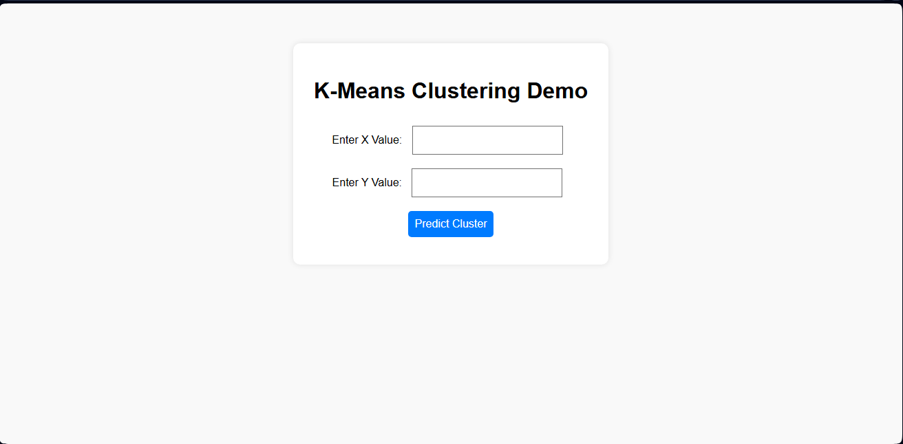
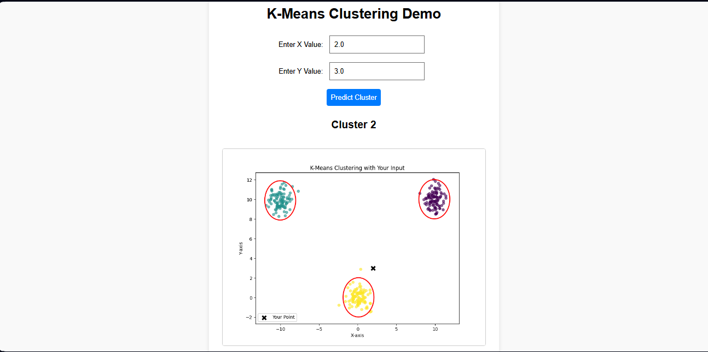

# 📊 K-Means Clustering Web App

This is a simple web application that demonstrates **K-Means Clustering** using `scikit-learn` and visualizes the result with user input. The app takes coordinate input from the user, predicts the cluster label using a pre-trained model, and displays the cluster visualization image with marked groups.

## ✨ Features

- Trains a K-Means model on generated 2D data.
- Saves the trained model using `pickle`.
- Accepts user input for prediction.
- Displays predicted cluster label.
- Shows a scatter plot with clusters visually separated using colors and circles.
- Built using Python Flask and basic HTML/CSS.

## 🛠️ Tech Stack

- Python  
- Flask  
- scikit-learn  
- matplotlib  
- pickle  
- HTML/CSS  

## 📂 Project Structure

K_Means/
├── model.py # Train and save the K-Means model
├── app.py # Flask app for prediction and display
├── kmeans_model.pkl # Pickled model
├── static/
│ └── style.css
├── templates/
│ └── index.html # Webpage template
├── README.md # Project documentation
├── requirements.txt # List of dependencies

Visit `http://localhost:5000` in your browser.

## 🔍 Sample Input / Output

| Input (X, Y) | Predicted Cluster |
|--------------|-------------------|
| 4.5, 2.3     | 1                 |
| 8.1, 6.2     | 0                 |

## 🖼️ App Screenshot (Optional)

🌐 Deployment (Optional)

🔗 [Live Demo](https://k-means-zue3.onrender.com)
